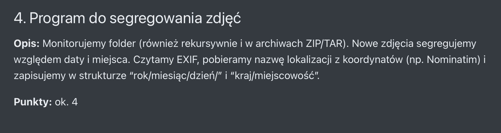

# 📸 PhotoSorter - Inteligentny Segregator Zdjęć z GPS



Program bazuje na programie który kiedyś napisałem przygotowując się do labolatoriów punktowanych:

[Link do repozytorium](https://github.com/unbreakableprogrammist/programowanie3-csharp/tree/main/wyklad_filesystem/Download_file_system_tracker)

---

## 🚀 Jak to działa?

Program działa w tle i wykorzystuje `FileSystemWatcher`. Gdy wykryje nowe zdjęcie:

1. **Analizuje EXIF:** Próbuje odczytać prawdziwą datę zrobienia zdjęcia (a nie datę pobrania pliku).
2. **Namierza GPS:** Jeśli zdjęcie ma współrzędne, łączy się z API **Nominatim (OpenStreetMap)**, aby zamienić cyferki na nazwę kraju i miasta.
3. **Segreguje:** Przenosi plik do struktury folderów `Rok/Miesiąc/`.
4. **Zmienia nazwę:** Jeśli udało się ustalić lokalizację, nazwa pliku zmienia się na np. `Polska_Warszawa_IMG_1234.jpg`.

---

## 🛠️ Wyzwania i Rozwiązania (Dev Diary)

Podczas pisania tego projektu natrafiłem na kilka specyficznych problemów, zwłaszcza związanych z działaniem systemu macOS i formatowaniem danych. Oto jak sobie z nimi poradziłem:

### 1. Problem "Roku 1601" i plików-duchów na macOS 👻

**Problem:** System macOS przy operacjach na plikach tworzy tymczasowe pliki ukryte (zaczynające się od kropki, np. `._IMG_2024.jpg`). Program próbował je przetwarzać zanim system skończył je zapisać. Ponieważ te pliki nie miały metadanych, C# domyślnie datował je na rok 1601 (początek czasu w Windows file time).
**Rozwiązanie:**

* Dodałem filtr ignorujący pliki zaczynające się od kropki (`.`).
* Dodałem zabezpieczenie logiczne: jeśli odczytana data jest wcześniejsza niż rok 1970, program uznaje to za błąd i pobiera datę bieżącą.

### 2. Kropka vs Przecinek w GPS (CultureInfo) 🌍

**Problem:** Mój system jest po polsku, więc liczby zmiennoprzecinkowe (double) mają przecinek (np. `52,22`). API Nominatim wymaga kropki (`52.22`). Przez to zapytania URL były błędne i geolokalizacja nie działała.
**Rozwiązanie:**

* Przy konwersji współrzędnych na string wymusiłem formatowanie "amerykańskie" używając `CultureInfo.InvariantCulture`.

### 3. Banowanie przez API (Rate Limiting) 🚫

**Problem:** Przy wrzuceniu pliku ZIP z 50 zdjęciami, program wysyłał 50 zapytań do API w ułamku sekundy. Darmowe API Nominatim blokuje dostęp przy >1 zapytaniu na sekundę.
**Rozwiązanie:**

* Zastosowałem `Thread.Sleep(1100)` w pętli przetwarzającej zdjęcia, aby sztucznie spowolnić program i szanować limity API.

### 4. Obsługa ZIP-ów 📦

**Problem:** `FileSystemWatcher` widzi plik `.zip` jako jeden obiekt. Nie wie, co jest w środku.
**Rozwiązanie:**

* Napisałem metodę `Handle_zip`, która tworzy tymczasowy folder, rozpakowuje archiwum, rekurencyjnie wyciąga zdjęcia, przetwarza je moją główną logiką, a na koniec sprząta po sobie (usuwa folder tymczasowy).

---

## 📦 Wymagane biblioteki (NuGet)

Do działania projektu konieczne jest doinstalowanie pakietu do obsługi metadanych:

```bash
dotnet add package MetadataExtractor

```

(Obsługa JSON i ZIP jest wbudowana w .NET, ale wymagała dodania odpowiednich `using`).

## ▶️ Jak uruchomić?

1. Sklonuj repozytorium / pobierz kod.
2. Zainstaluj wymagane paczki (powyżej).
3. Uruchom program podając ścieżkę do folderu, który chcesz monitorować (np. Pobrane):

```bash
dotnet run /Users/twoja_nazwa/Downloads

```

---

*Autor: Krzysztof (Student)*